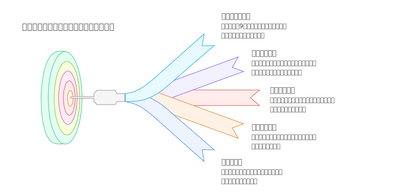
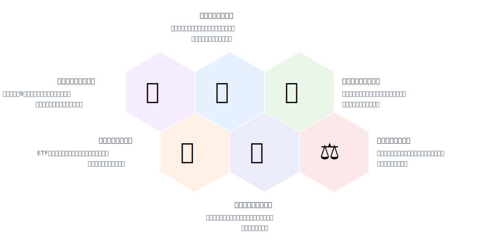

# SVG 生成

有道云笔记的文本转图片功能很酷炫，复制了一个类似的功能

下面是个例子，从新浪财经中复制一篇新闻的文本，然后可以生成下面的图片

<details>
  <summary>点击展开查看详情文本</summary>

[金价突破3,500美元创历史新高 受美联储降息押注推动](https://finance.sina.com.cn/stock/usstock/c/2025-09-02/doc-infpanvn0319863.shtml)
```
　　金价触及纪录高点，美联储降息前景以及对其独立性的担忧给贵金属近年来的涨势注入新动力。

　　周二亚洲早盘交易中，现货黄金一度上涨0.9%，至每盎司3，508.73美元，超过了4月创下的前高点；目前涨幅有所收窄。今年以来，黄金价格已上涨逾30%，成为表现最佳的主要大宗商品之一。

　　美联储主席杰罗姆·鲍威尔谨慎地为9月降息打开大门后，市场对于本月降息的预期升温，从而助推了黄金最新一波涨势。本周五将公布的美国就业报告可能再添劳动力市场疲软迹象，这将为降息提供支撑。

　　“投资者增加黄金配置，尤其是在美联储降息近在眼前的情况下，这正在推高金价。”瑞银集团策略师Joni Teves表示。“我们的基本预测是，未来几个季度金价将继续创下新高。较低的利率环境、疲软的经济数据、持续上升的宏观不确定性和地缘政治风险，增强了黄金作为投资组合多元化工具的角色。”

　　过去三年，黄金及白银价格均上涨逾一倍，地缘政治、经济和全球贸易领域的风险不断上升，推动了人们对这些传统避险资产的需求增长。今年，特朗普对美联储的攻击升级，成为投资者担忧的最新因素，围绕美联储独立性的担忧可能会削弱对美国的信心。

　　黄金上一次飙升至纪录高位是在4月，当时特朗普公布了一项初步计划，将对大多数美国贸易伙伴征收全面关税。之后，由于特朗普暂缓了一些最激进的贸易提议，避险需求有所降温，金价很快回落，并在几个月内基本维持区间波动。

　　“3，500美元以上的空间尚未可知，因此市场将密切关注价格走势。上次金价突破 3，500美元是在日内交易中，因此我们非常期待观察金价能否在收盘价突破该水平，因为这可能会带来一些上涨动能，”华侨银行外汇策略师Christopher Wong表示。“新的地缘政治风险和政策不确定性再次出现的风险仍然存在，这将给黄金带来利好。”

　　与此同时，银价涨势更劲，今年以来已上涨逾40%， 周一价格自2011年以来首次突破每盎司40美元。白银还因其在太阳能电池板等清洁能源技术中的工业用途而受到重视。在此背景下，据行业组织白银协会，市场势将第五年供应短缺。美元走弱也提振了中国和印度等主要消费国的购买力。

　　投资者纷纷涌入白银支持的ETF，8月持仓连续第七个月扩张。这减少了伦敦的白银库存，导致市场持续吃紧。租赁利率——反映金属借贷成本，通常期限较短——仍然保持在2%左右的高位，远高于接近于零的正常水平。

　　可能面临美国关税的担忧也给贵金属带来了支撑。上周，白银被添加到华盛顿的关键矿产清单中，其中已经包括钯。

　　截至发稿，现货黄金上涨0.45%，至每盎司3，491.5美元。彭博美元现货指数持稳。白银价格基本持平，报每盎司40.67美元。铂价上涨，钯价下跌。
```
</details>





## 生成过程

1. 先用大模型总结文本，生成几点摘要
2. 套用 html 模版，用到 Handlebars 包
3. html 转 SVG，用到 satori 包


## 本地运行

```
npm run dev
```

## 项目结构

```

```